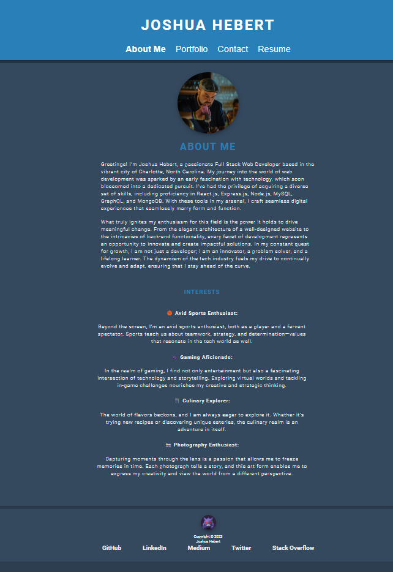
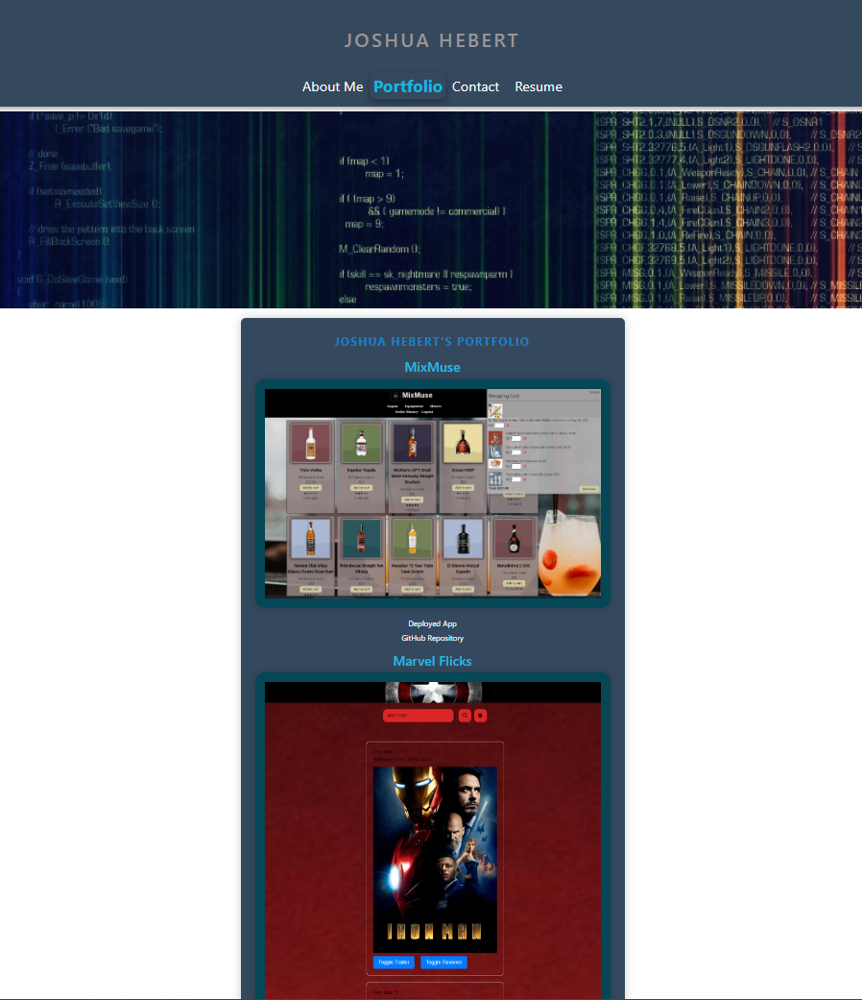
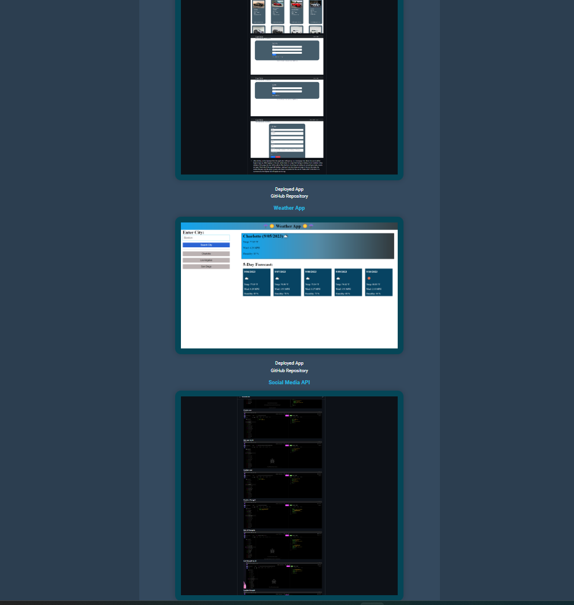
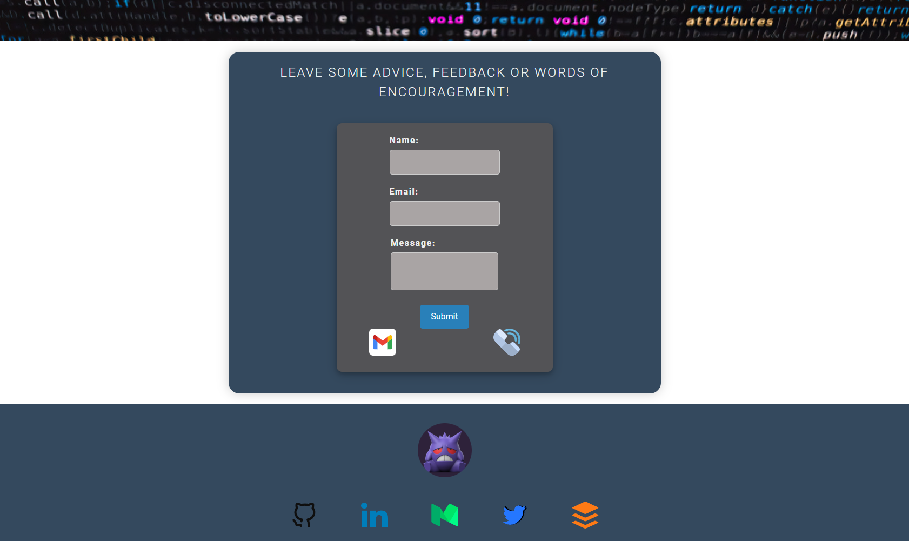
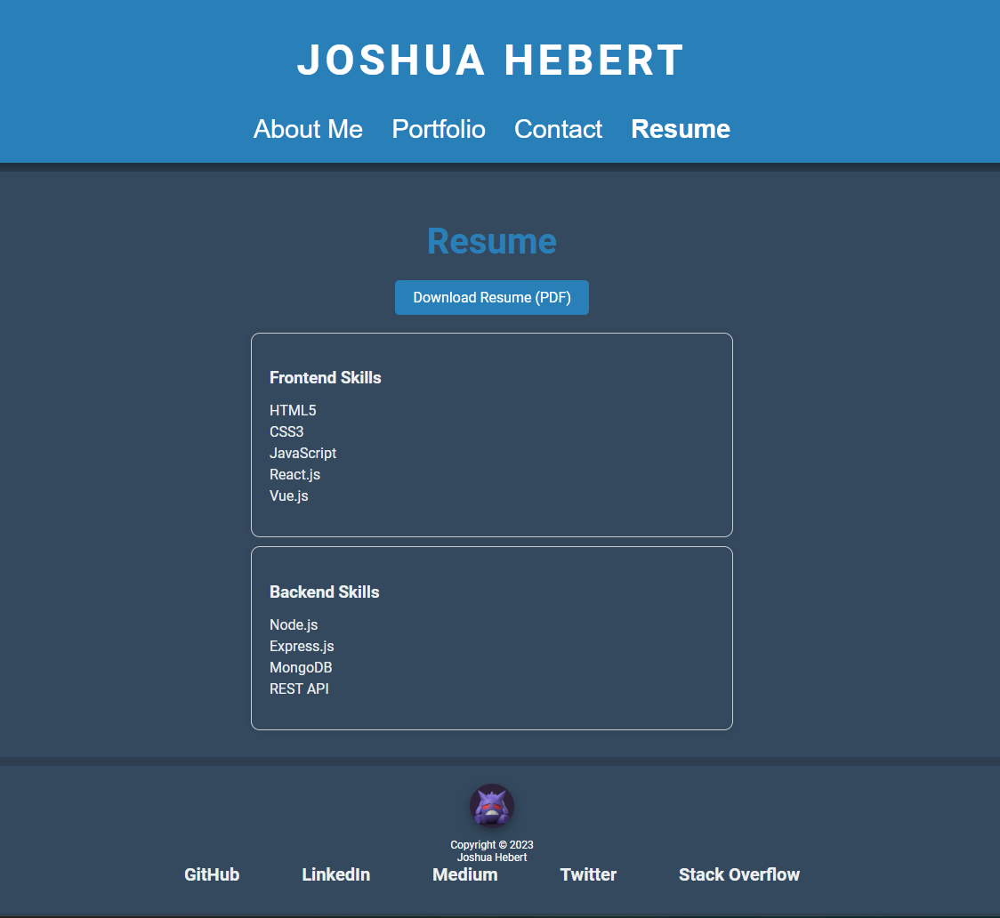
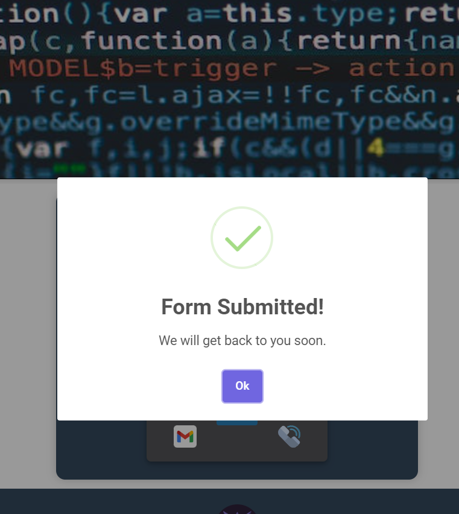
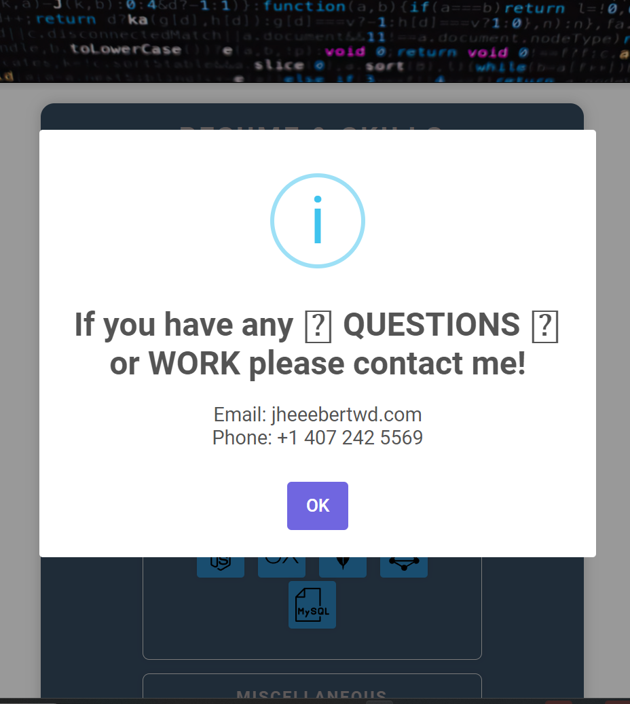

# Joshua Hebert React Portfolio

## Description

As an experienced web developer passionate about creating engaging and seamless user experiences, my React portfolio showcases my dedication to crafting exceptional single-page applications. Through this portfolio, I invite you to explore a curated selection of my work, gaining insight into my skills, creativity, and attention to detail.

From the moment you land on the main page, you'll be greeted with a user-friendly interface that reflects my commitment to intuitive design. The navigation seamlessly guides you through different sections, each offering a glimpse into various aspects of my professional journey.

## What My Portfolio Represents

- **Technical Proficiency**: The projects in my portfolio demonstrate my proficiency in React, showcasing how I utilize this powerful library to build interactive and dynamic web applications.

- **Problem-Solving Abilities**: In every project, I tackle unique challenges, employing innovative solutions that speak to my problem-solving capabilities.

- **Versatility and Adaptability**: My diverse range of projects highlights my ability to adapt to different technologies and project requirements, showcasing versatility in my skill set.

- **Passion for Learning and Growth**: Through my portfolio, you'll see not just completed projects but a continuous journey of learning and improvement. I'm dedicated to staying up-to-date with the latest technologies and frameworks.

- **User-Centric Focus**: I prioritize the end-user experience in all my projects. Intuitive design, seamless navigation, and engaging interfaces are at the core of my development approach.

## Table of Contents

- [Joshua Hebert React Portfolio](#joshua-hebert-react-portfolio)
  - [Description](#description)
  - [What My Portfolio Represents](#what-my-portfolio-represents)
  - [Table of Contents](#table-of-contents)
  - [Installation](#installation)
  - [Usage](#usage)
  - [Screenshots](#screenshots)
  - [License](#license)
  - [Contributing](#contributing)
  - [Questions](#questions)

## Installation

- Clone the repository: `git clone https://github.com/jheeebert/joshua-hebert-react-portfolio.git`
- Navigate to the project directory: `cd joshua-hebert-react-portfolio`
- Install dependencies: `npm install`

## Usage

- Run the app: `npm start`
- Open your browser and visit the [Joshua Hebert React Portfolio](https://jheeebert.github.io/joshua-hebert-react-portfolio/)

## Screenshots

 **Main Page**  
 
 **About Me**  
 
 **Portfolio Image2**  
 
 **Contact**  
 
 **Resume**  
 
 **Resume Hover**  
 
 **Resume Hover**  
 
 **SweetAlert Form Submit**  
 
 **Sweet Alert Download Resume Confirm**  
 
  **Sweet Alert Contact Display After Confirm**  

## License

## Contributing

We welcome contributions! Please follow the steps outlined in the [Contributors Covenant](https://www.contributor-covenant.org/).

## Questions

- Ask anything: [Ask Me Anything](https://GitHub.com/jheeebert/joshua-hebert-react-portfolio)
- Contact: Email me at jheeebertwd@gmail.com
- More of our work: [GitHub Profile](https://github.com/jheeebert/)
